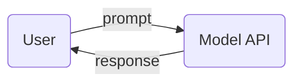
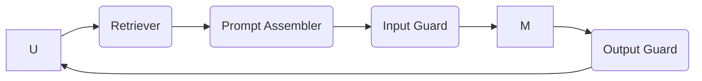
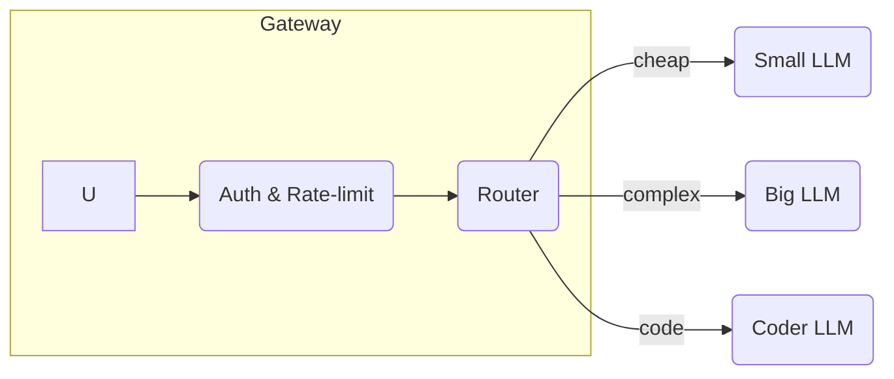

# 🚀 Chapter 10 — **AI Engineering Architecture & User Feedback Loops**

> **Aim** — deliver an actionable blueprint for designing **scalable, monitored, and continuously improving** AI applications.  This chapter stitches every prior concept (prompting, RAG, finetune, inference) into an end‑to‑end architecture, plus feedback mechanisms that turn usage data into model gains.

---

## 1️⃣  Architecture Progression (From Simple → Enterprise‑Grade)

### 1.1  V0: Direct Call Pattern



* **When OK**: internal PoC, hackathons.
* **Limitations**: no context, no guardrails, no observability.

### 1.2  V1: RAG + Guardrails



* Adds retrieval and safety layers; start logging metrics.

### 1.3  V2: Model Router & Gateway (Multi‑Model)



* Choose model per task: saves cost up to 70 % (Shopify Broker 2024).

### 1.4  V3: Orchestrated Agent Graph

* **Frameworks**: LangGraph, CrewAI, Autogen 2.
* Nodes = tools / LLM calls, edges = conditions.
* Example: Trip‑planner agent → Planner LLM → Flight API → Hotel RAG → Price Tool.

---

## 2️⃣  Core Architectural Components & Design Tips

| Layer               | Key Choices                                            | Pitfalls                                  |
| ------------------- | ------------------------------------------------------ | ----------------------------------------- |
| **Gateway**         | Auth, rate‑limit, request schema validation.           | JSON schema drift.                        |
| **Context Builder** | RAG, tool results, conversation memory.                | Oversized context → cost/latency blow‑up. |
| **LLM Router**      | Rule‑based, embedding similarity, or small classifier. | Mis‑routing hits accuracy & cost.         |
| **Guardrails**      | Moderation, PII mask, format validator.                | False positives block legit queries.      |
| **Observability**   | Trace each hop; token usage; user feedback.            | No sampling → 💾 explosion.               |
| **Feedback Store**  | Vote logs, error spans, embeddings of bad cases.       | GDPR delete requests.                     |

Real‑World Example — **GitHub Copilot** pipeline attaches telemetry: IDE events → anonymised tokens → eval cluster → nightly alignment data.

---

## 3️⃣  Feedback Loop Taxonomy

| Feedback Type           | Collection Method                  | Use‑Case                          |
| ----------------------- | ---------------------------------- | --------------------------------- |
| **Thumbs Up/Down**      | UI button                          | RLHF fine‑tune refresh.           |
| **Corrected Output**    | Inline edit capture (Notion AI)    | Supervised SFT dataset v2.        |
| **Implicit Metrics**    | Time‑to‑resolve, follow‑up queries | Product KPI, A/B prompt tuning.   |
| **Tool Outcome**        | Did tool call succeed (HTTP 200)?  | Reward function shaping.          |
| **Conversation Re‑use** | Retrieval of past chats            | Long‑term memory personalization. |

### 3.1  Storage Design

* Append‑only `feedback.parquet` with fields: `user_id` (hash), `prompt_hash`, `model_id`, `latency_ms`, `score`, `corrected_text`, timestamp.
* Apply **delta‑merge** every 24 h to training lake (LakeFS) → triggers CI pipeline.

### 3.2  Learning Pipeline

```text
Daily Cron → Pull new feedback → Filter high‑quality • Dedup → Mix with offline eval failures → Train LoRA adapters → Canary deploy via feature flag → Online A/B metrics → Promote if wins.
```

*Spotify DJ* uses this loop; 2‑day iteration, 0.6 pp weekly CSAT gain.

---

## 4️⃣  Real‑World Case Studies

### 4.1  Khan Academy Khanmigo

* **Architecture**: RAG + Math‑Tool + RLHF loops.
* **Feedback**: Student thumbs/down & teacher flags.
* **Result**: Math score improvement 15 %.  Retraining weekly on 50 K new interactions.

### 4.2  Zendesk Answer Bot (Enterprise 2025)

* Router directs billing Q’s to small FAQ LLM, tech Q’s to big model.
* Live user edits captured; diff tool auto‑labels good answers.
* Cost/answer ↓ 62 %; deflection rate ↑ 9 pp.

### 4.3  Stripe Docs‑AI

* Combines code execution tool to test CURL examples.
* Feedback = API error vs success logs; model auto‑fixes docs.

---

## 5️⃣  Monitoring & SLOs

| Signal                | Healthy Range | Dash Tool            |
| --------------------- | ------------- | -------------------- |
| p95 Latency           | < 800 ms      | Prometheus + Grafana |
| Token / Query         | trending flat | BigQuery Looker      |
| Moderation Violations | < 0.02 %      | OpenAI mod exporter  |
| Groundedness          | > 0.8 (RAGAS) | LangSmith dashboards |
| User CSAT             | +1 pp MoM     | Amplitude events     |

Alert rules (YAML):

```yaml
- alert: high_moderation_hits
  expr: sum(rate(mod_violation_total[5m])) > 5
  for: 10m
  labels: { severity: critical }
```

---

## 6️⃣  Security & Multi‑Tenancy

1. **Tenant‑aware RAG filters** (row‑level ACL).
2. **Prompt fingerprinting** to block repeated jailbreaks (hash user input).
3. **Canary Killswitch** — feature flag to drain traffic from buggy model.
4. **Differential Privacy Noise** on logs for regulatory markets (EU AI Act).

---

## 7️⃣  Cost Governance

* **Budget Alerts**: tokens/day > budget → route to cheaper model.
* **Shadow Mode**: test new model behind scenes, only 5 % cost overhead.
* **Org‑level Quotas** (OpenAI) → prevent bill-shock.

Large bank POC (2025) saved \$1.2 M/yr by tiering: 70 % queries answered by 7 B open‑source model, rest escalated.

---

## 8️⃣  Advanced 2025 Architectures

| Innovation                 | Description                                                      | Example                  |
| -------------------------- | ---------------------------------------------------------------- | ------------------------ |
| **Model Mesh**             | Per‑request weights streamed just‑in‑time to GPU pods.           | Google Pathways Serving. |
| **Edge Hybrid**            | First‑pass summary on device, escalate to cloud for deep answer. | Apple iOS 19 Siri.       |
| **Event‑Driven Functions** | LLM chooses AWS Lambda to run code; pay‑per‑millisecond.         | IKEA AR catalog bot.     |
| **Live RL (Bandit)**       | Router learns cheapest model that meets success prob per user.   | TikTok Live‑AI captions. |

---

## 9️⃣  Implementation Checklist

1. **Map User Journeys** & required model skills.
2. **Design Router Rules** (regex, classifier, cost tier).
3. **Add Guardrails + Logging** early.
4. **Establish Feedback Schema & Store**.
5. **Deploy v0** (small traffic) & set baseline metrics.
6. **Wire Continuous Train‑Eval Loop** (weekly).
7. **Iterate** architecture layers only as complexity justifies.

---

## 🔚  Takeaways

* Start simple; add RAG, router, agent layers incrementally.
* Feedback is *data gold* — mine it for continual learning.
* Observability, security, and cost controls must ship with v1, not retrofitted.
* Routing + model mix often yields 50‑70 % inference \$ savings.

> "Architect for today, instrument for tomorrow, learn forever."
