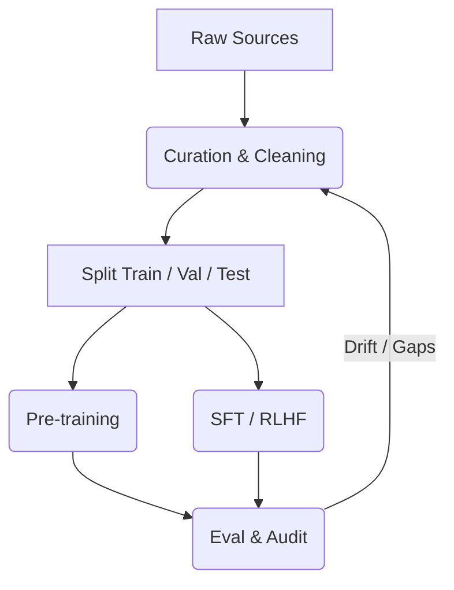

# 🚀 Chapter 8 — **Dataset Engineering & Data‑Centric AI**

> **Goal** – give you a *field manual* for curating, generating, augmenting, and governing data that makes—or breaks—foundation‑model performance.  We weave together lessons from GPT‑4, Gemini, Llama‑3, enterprise deployments (banking, healthcare), and 2024‑2025 research.

---

## 1️⃣  Fast Glossary

| Term                             | Definition                                                                               | Production Impact                       |
| -------------------------------- | ---------------------------------------------------------------------------------------- | --------------------------------------- |
| **Data‑Centric AI**              | Optimise model quality by improving data, not model code.                                | 10× cheaper than scaling params.        |
| **Dataset Curation**             | Process of collecting, filtering, deduplicating, class‑balancing, & annotating raw data. | Determines ceiling of model capability. |
| **Self‑Supervised Data**         | Unlabeled sequences used for pre/continued training.                                     | Abundant but noisy.                     |
| **Instruction Data (SFT)**       | `(instruction, input, output)` triples.                                                  | Teaches model task formats & style.     |
| **Preference / Comparison Data** | `(prompt, chosen, rejected)` tuples.                                                     | Train reward models (RLHF / DPO).       |
| **Synthetic Data**               | Model‑generated examples, optionally human‑vetted.                                       | Bootstraps scarce domains cheaply.      |
| **Data Lineage / Provenance**    | Traceability of each record’s source & license.                                          | Compliance & reproducibility.           |
| **Overlap / Leakage**            | Portion of eval set present in training data.                                            | Inflates benchmarks; must audit.        |
| **Toxicity / Bias Filter**       | Classifier or rule set removing harmful text.                                            | Safety & legal risk mitigation.         |
| **Deduplication**                | Remove near‑identical shards (SimHash, MinHash).                                         | Prevents over‑memorisation.             |

---

## 2️⃣  The Data‑Centric Lifecycle

> **Insight** – treat data pipelines like code: version, test, diff, roll back.

---

## 3️⃣  Source Acquisition

| Source                        | Strengths                         | Risks                                | Notes                                          |
| ----------------------------- | --------------------------------- | ------------------------------------ | ---------------------------------------------- |
| **Common Crawl CC‑Net**       | Huge, multilingual.               | Noisy, disinfo.                      | Filter by `quality > 0.8`, top‑level domains.  |
| **Books3**                    | Well‑edited prose style.          | Copyright litigation (2024 verdict). | Use open‑licensed subsets (Project Gutenberg). |
| **StackOverflow 2024 Dump**   | High‑quality code Q\&A.           | License: CC‑BY‑SA.                   | Retain attribution per clause.                 |
| **PubMed Central**            | Biomedical abstracts & full‑text. | Domain heavy jargon.                 | Great for medical LLMs.                        |
| **Internal Corp Docs**        | Proprietary knowledge.            | PII, trade secrets.                  | Redact, tenancy isolation.                     |
| **Synthetic (Self‑Instruct)** | Infinite supply.                  | Quality variance, domain drift.      | Human curate 5‑10 % seed.                      |

---

## 4️⃣  Data Curation Pipeline (Template)

1. **Ingest →** fetch & store raw docs (S3, Delta‑Lake).
2. **Text Extraction →** PDF→text, HTML boilerplate removal.
3. **Language ID & Sharding →** fastText lang‑id; route to per‑lang folders.
4. **Deduplication →** MinHash LSH (threshold = 0.8).
5. **Toxicity & PII Filter →**

   * OpenAI Moderation API or Perspective v4.0
   * Presidio anonymiser (names, emails, gov IDs).
6. **Metadata Enrichment →** source, license, timestamp, tags.
7. **Quality Scoring →** perplexity (small LM), readability (Flesch), doc length.
8. **Stratified Split →** maintain domain/lang class balance in train/val/test.
9. **Version & Snapshot →** DVC or LakeFS commit; tag with semantic version.

---

## 5️⃣  Quantity vs Quality Trade‑off

| Scenario             | Empirical Finding (2024‑25 papers)                                       |
| -------------------- | ------------------------------------------------------------------------ |
| Web‑scale pre‑train  | Quality‑filtered 15 B tokens matched 100 B raw tokens (Gunasekar 2023).  |
| Domain models (<7 B) | Better to oversample high‑quality narrow corpus than dilute with CC‑Net. |
| Code LLM             | 7 B tokens curated code > 1 T mixed tokens.                              |

**Heuristic** – token budget ∝ (model params) × (4‑5).  Beyond that, diminishing returns unless *new* domain.

---

## 6️⃣  Synthetic Data Strategies

### 6.1  Self‑Instruct 2.0 Workflow

1. Seed 1 K human tasks.
2. Use GPT‑4o to auto‑generate 10× new tasks.
3. Deduplicate & quality‑rank tasks; keep top 30 %.
4. Human spot‑check 5 % for safety.

### 6.2  Role‑Play Conversations

* Use multi‑model chat (e.g., two Llama‑3‑Instruct) to produce realistic dialogues.
* Filter with perplexity and toxicity classifier.

### 6.3  Synthetic Code Explanations

* Prompt LLM to add inline comments for raw GitHub functions.
* Evaluated with BLEU against human comment subset.

> 🔍 **Metric** – *Diversity Score* (Unique n‑gram ratio) ensures synthetic set isn’t repetitive.

---

## 7️⃣  Compliance, Ethics & Governance

| Area                     | Best Practice                                                  |
| ------------------------ | -------------------------------------------------------------- |
| **License Tracking**     | Maintain SPDX doc; record SPDX ID per file.                    |
| **Sensitive Domains**    | Medical, legal → add SME review gate.                          |
| **Geo‑Restricted Data**  | Respect data‑residency (EU‑GDPR, UAE 2025 AI Law).             |
| **Attribution**          | Inject citation metadata; enable downstream user credit.       |
| **Transparency Reports** | Publish high‑level stats (language %, domain %, filter rates). |

---

## 8️⃣  Evaluation of Data Quality

| Metric                | Tool                                    | Target                      |
| --------------------- | --------------------------------------- | --------------------------- |
| **Coverage**          | Stratified histogram over domains.      | matches production queries. |
| **Noise Rate**        | Manual label 1 K sample; compute bad %. | < 2 %.                      |
| **Toxic Rate**        | Perspective severe\_toxicity.           | < 0.5 %.                    |
| **Overlap with Eval** | NearDup ratio via cosine sim ≥ 0.9.     | 0 %.                        |
| **Information Gain**  | Δ perplexity on val set after 1 epoch.  | > 0.5 nat.                  |

Automate with **DataComp Evaluator** scripts + Great Expectations rules.

---

## 9️⃣  Advanced 2025 Techniques

1. **Active Data Selection** – compute gradient‑based influence scores; keep most informative samples (Zhang 2024).
2. **Mixture‑of‑Dataset Weighting** – train P‑router predicting which dataset best improves next batch (Google Gemini‑Fusion).
3. **Contrastive Data Refinement (CDR)** – pair positive/negative passages to teach retrieval models.
4. **LLM‑powered Filter Chains** – small model ranks, large model explains removal verdict; human confirm only controversial cases.
5. **Data Wallets** – blockchain‑based provenance + micro‑payments to original creators (Ubiquity 2025 pilot).

---

## 🔟  Step‑by‑Step Implementation Checklist

1. **Define Use‑Case & Coverage Goals**.
2. **Inventory Potential Sources** – open, licensed, internal.
3. **Bootstrap Curation Pipeline** (ETL code repo).
4. **Run Quality Audit v0** – noise, toxicity, PII.
5. **Create Split v1**, tag version.
6. **Train Probe Model** – small 1‑B to gauge perplexity gains.
7. **Iterate Filters / Data Mix** until val perplexity plateau.
8. **Launch Finetune/RAG** with dataset v\*.
9. **Monitor Production Drift** – track retrieval recall, OOD queries.
10. **Refresh & Re‑version** quarterly or on schema change.

---

## 🔚  Key Takeaways

* **Data quality is the strongest signal multiplier** – garbage in, hallucinations out.
* Automate but **always keep human eyes** on samples for critical domains.
* Track lineage & license from day 1 to avoid costly rewrites.
* Use synthetic data judiciously; measure diversity & utility.
* Data pipelines deserve CI/CD, observability, and security equal to model code.

> “The model *is* the data.” — Andrew Ng, 2021
